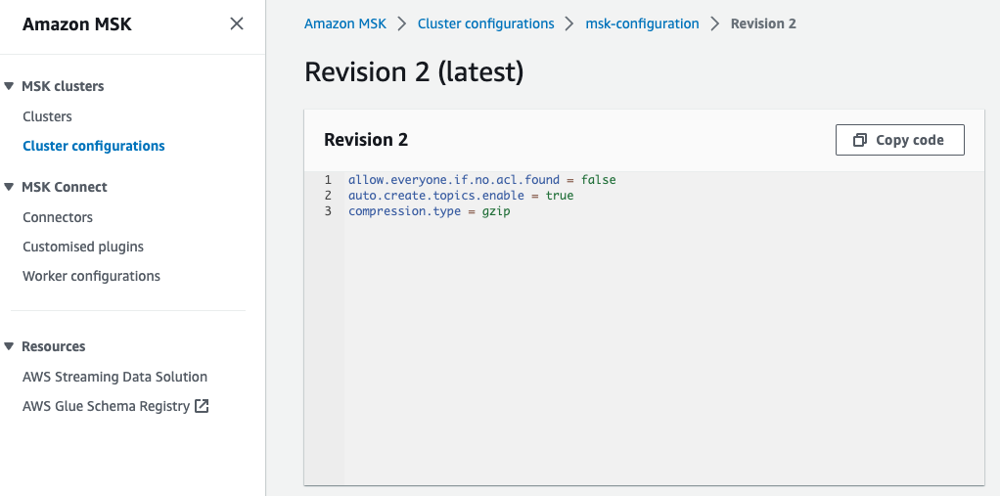

### Configuration considerations
The module variable `kafka-properties` is a map of configurations i.e.:

```bash
kafka-properties = {
    "auto.create.topics.enable" = "true",
    "compression.type" = "gzip",
    "allow.everyone.if.no.acl.found" = "false"
  }
```
Add any required kafka broker configuration tweaks to this variable if required.  The configuration can be viewed via AWS Console

