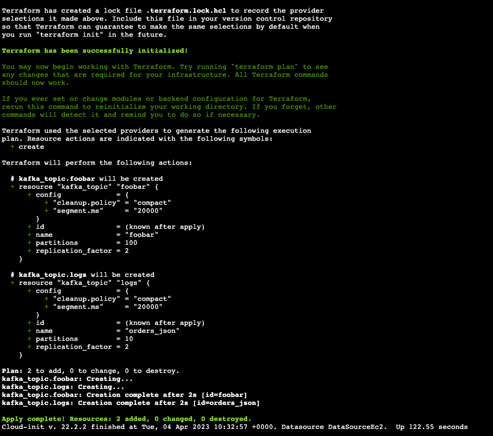

Mock something like this:

https://medium.com/brexeng/migration-from-self-managed-kafka-cluster-to-amazon-msk-8b7dbc27bf00

Each connection type will have a different configuration file which are documented below:
#### Connection via IAM
```bash
bootstrap.servers=b-2.osomskexample.v1ien5.c8.kafka.eu-west-1.amazonaws.com:9098,b-1.osomskexample.v1ien5.c8.kafka.eu-west-1.amazonaws.com:9098,b-3.osomskexample.v1ien5.c8.kafka.eu-west-1.amazonaws.com:9098
ssl.keystore.type=PEM
ssl.keystore.location=/root/full-chain.pem
security.protocol=SASL_SSL
sasl.mechanism=AWS_MSK_IAM
sasl.jaas.config=software.amazon.msk.auth.iam.IAMLoginModule required;
sasl.client.callback.handler.class=software.amazon.msk.auth.iam.IAMClientCallbackHandler
```