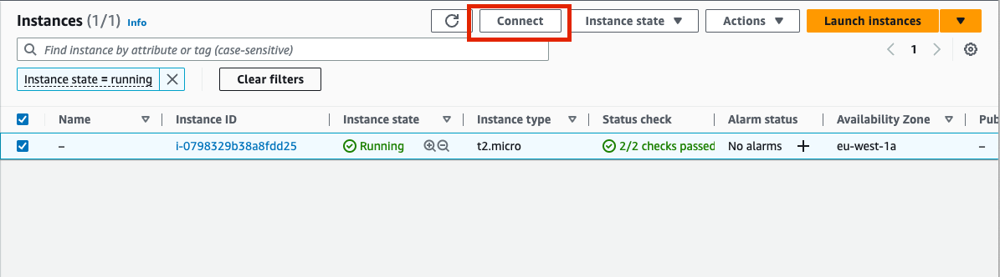

### Connecting to Swiss-Army Knife


The bastion is deployed with SSM which provides a simple way to access the box 


After connecting, assume role of sudo by running `sudo -s`

To observe the provisioning logs, run `cat /var/log/cloud-init-output.log` where you will see output similar to this:
```bash
arn:aws:acm-pca:eu-west-1:109716644331:certificate-authority/fd628b4f-3079-4529-9d35-ef43ccefef65
b-3.osomskexample.hx19r8.c8.kafka.eu-west-1.amazonaws.com:9094,b-2.osomskexample.hx19r8.c8.kafka.eu-west-1.amazonaws.com:9094,b-1.osomskexample.hx19r8.c8.kafka.eu-west-1.amazonaws.com:9094
Adding ACLs for resource `ResourcePattern(resourceType=CLUSTER, name=kafka-cluster, patternType=LITERAL)`:
        (principal=User:alice, host=*, operation=ALL, permissionType=ALLOW)

Current ACLs for resource `ResourcePattern(resourceType=CLUSTER, name=kafka-cluster, patternType=LITERAL)`:
        (principal=User:alice, host=*, operation=ALL, permissionType=ALLOW)

Adding ACLs for resource `ResourcePattern(resourceType=TOPIC, name=iam-topic-in-source, patternType=LITERAL)`:
        (principal=User:alice, host=*, operation=ALL, permissionType=ALLOW)

Current ACLs for resource `ResourcePattern(resourceType=TOPIC, name=iam-topic-in-source, patternType=LITERAL)`:
        (principal=User:alice, host=*, operation=ALL, permissionType=ALLOW)

Created topic iam-topic-in-source.
Created topic mtls-topic-in-source.
```

